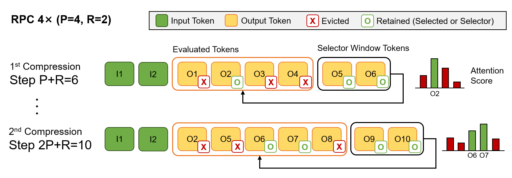
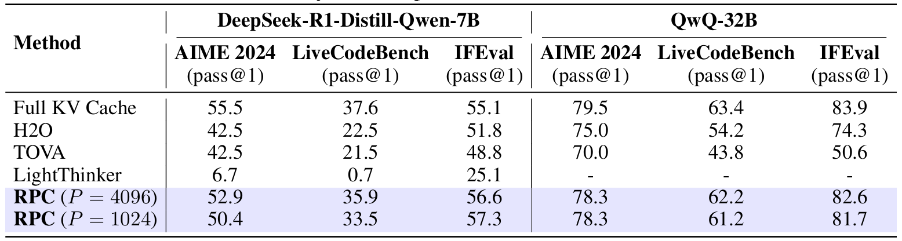
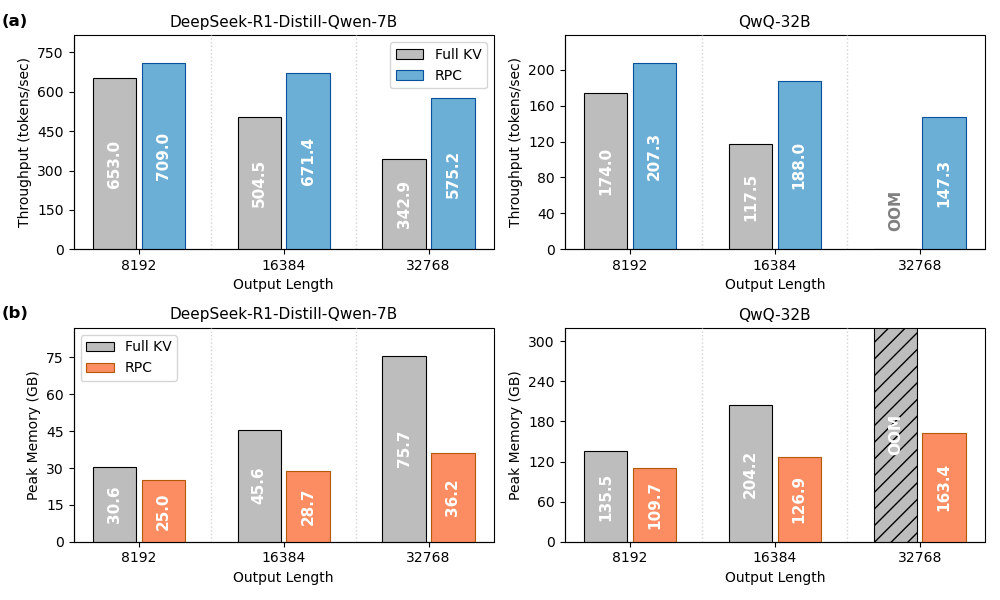

# Reasoning Path Compression: Compressing Generation Trajectories for Efficient LLM Reasoning

    

This is a official repository of **"Reasoning Path Compression: Compressing Generation Trajectories for Efficient LLM Reasoning"**.
**RPC** is a *training-free* method for accelerating inference of reasoning language models by leveraging the semantic sparsity of generated reasoning paths. 
It improves throughput and reduces memory usage with minimal accuracy drop.

## 🚀 Key Features

- **Efficient Inference for Reasoning LLMs**  
  Speeds up autoregressive decoding by selectively pruning KV cache entries while preserving reasoning quality.

- **Training-Free Compression**  
  Applies directly at inference time without requiring fine-tuning or supervision.

- **Semantic-Aware Pruning**  
  Retains only tokens with high importance, estimated from a small attention-based selector window of recent queries.

- **Significant Throughput Gains**  
  Up to **1.60×** faster generation with only **1.2%** drop in pass@1 accuracy on the AIME 2024 benchmark.

- **Memory Usage Reduction**  
  Shrinks KV cache size during decoding, enabling longer generations under memory constraints.

### Key Results

## Usage
### 1. Install

    git clone https://github.com/jiwonsong-dev/ReasoningPathCompression.git
    conda create -n rpc python=3.11
    conda activate rpc
    cd ReasoningPathCompression
    
    # install requirements
    pip install -r requirements.txt

    # install flash-attn
    # We recommend installing flash-attn version suitbale for your environment
    # The links can be found at: https://github.com/Dao-AILab/flash-attention/releases/tag/v2.7.4.post1
    pip install flash-attn==2.7.4.post1

### 3. Run

    # Run demo with custom input prompt
    python -m example

    # Run evaluation on reasoning benchmarks
    bash scripts/run_aime24.sh
    bash scripts/run_livecodebench_v5.sh
    bash scripts/run_ifeval.sh

    # Run throughput benchmark
    bash scripts/benchmark_throughput.sh

## Acknowledgements
Our codes for running evaluation and scoring the results are based on [QwQ](https://github.com/QwenLM/QwQ) repository.

